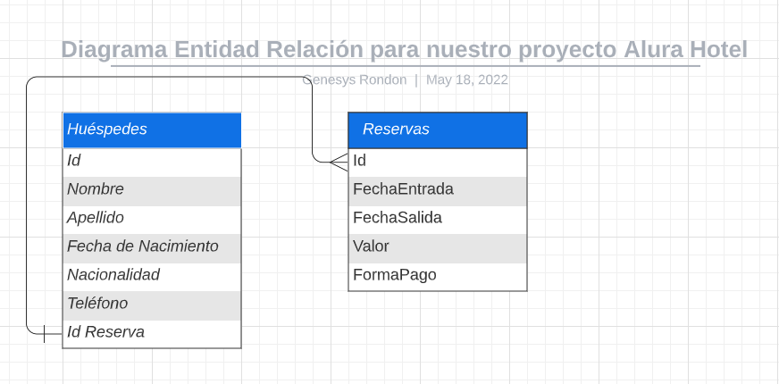
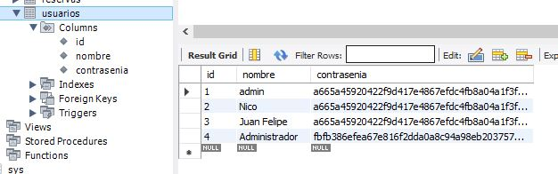
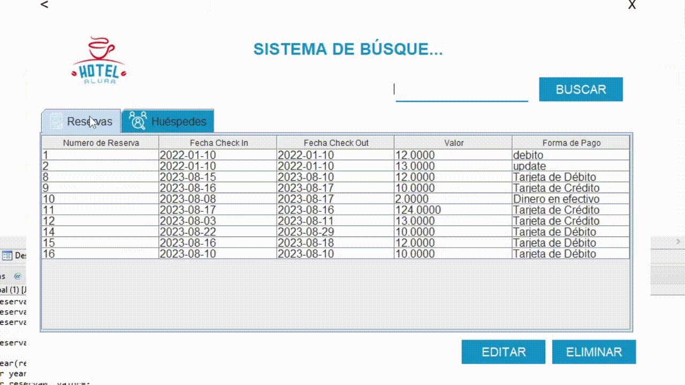
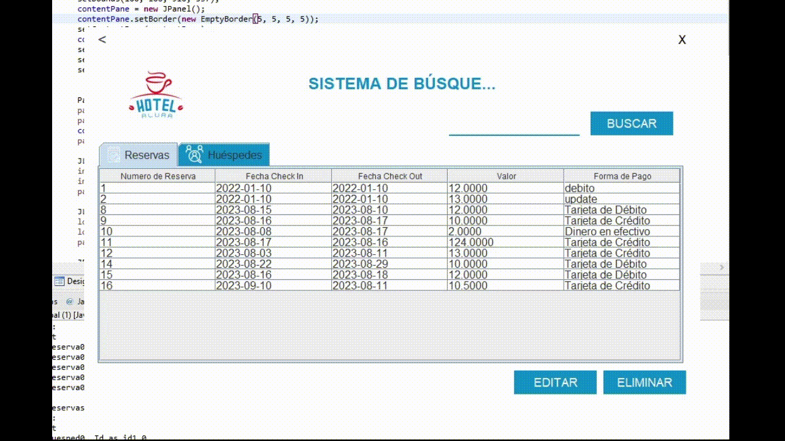
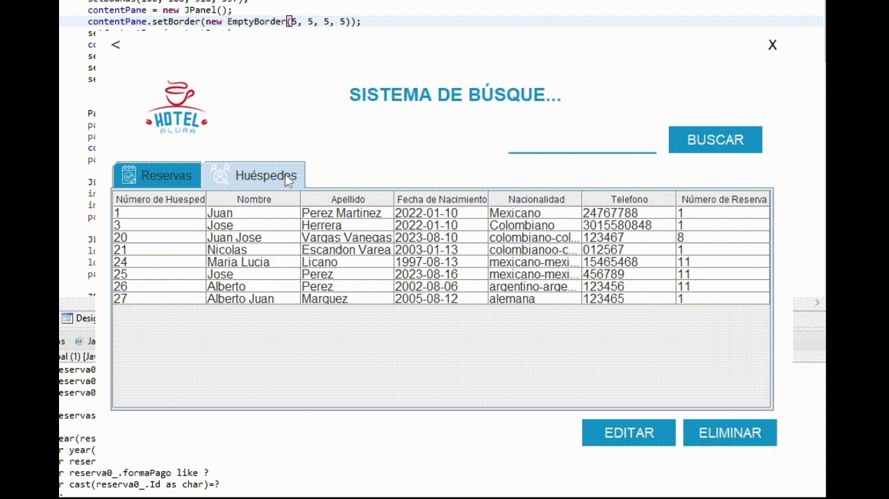
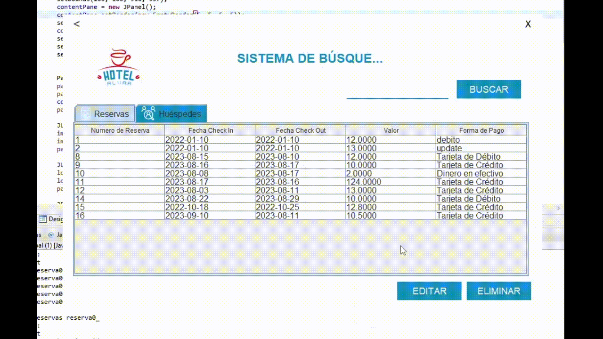

# 🏅 Challenge ONE | Java | Back-end | Hotel Alura

---

Este proyecto es un sistema básico de gestión de reservas para un hotel.

Es la resolución del desafío del Challenge de creación de un sistema de reserva para el Hotel Alura, impartido por el Programa Oracle One en coordinación con Alura Latinoamérica.

---
## ⚒ Tecnologías Utilizadas:

- Java SE
- Eclipse
- Swing
- Biblioteca JCalendar
- Maven
- MySql 
- JPA: Hibernate
- Plugin WindowBuilder

---

## 📁 Estructura de directorios:
- src/main/java: Carpeta base donde se guarda el código del proyecto.
- imagenesReadme:  Las imágenes para el readme.
- src/main/resources: Se guardan recursos como META-INF.

---

## 📦 Los paquetes en /src/main/java:
- views:  Agrupa las interfaces gráfica hechas con WindowBuilder.
- com.alura.hotel.models: Agrupa los modelos.
- com.alura.hotel.dao:  Agrupa las operaciones de acceso a base de datos.
- com.alura.hote.utils: Agrupa utilitarios.

## 📦 Los paquetes en /src/tests/java:
- com.alura.hotel.tests: Único paquete para las pruebas.

---

## 🎥 Video de la aplicación

---

## 💾 Diagrama de la base de datos

## 💾 Modelo de Usuarios con contraseñas cifradas

### Usuarios de Prueba:

| Usuario            | Contraseña               |
| -------------------|--------------------------|
| admin              |           123            |
| Administrador      |           123qwe         |
| Nico               |           123            |

---

##  Overview

---

## Registros Reserva/Huesped

---

## Búsqueda Por Columnas

---

## Editar Reservas

---

## Editar Huésped

---

## Eliminar Huésped/Reserva

---

## 💼  [Linkedin](https://www.linkedin.com/in/nicolas-escandon/)
